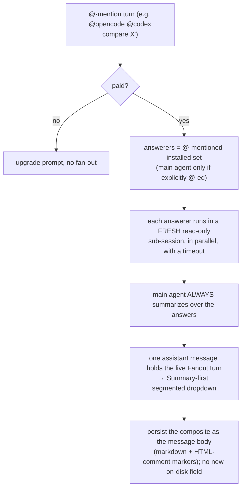

# Multi-Agent Per-Turn QA (Fan-Out) Architecture

How one `@agent`-mentioned chat turn fans out to several coding agents in
parallel, gets summarized by the session's own agent, renders as a single
switchable assistant message, persists losslessly, and is gated to paid users.
Landed in PR #2628 (`v4-preview`).

## What it does

Each mentioned agent answers the same question independently in an ephemeral
read-only sub-session; the session's own agent then writes a narrative summary
over those answers. The turn renders as one assistant message with a
Summary-first tab row switching between the summary and each agent's full answer.

## Modules

| Stage              | Module                                                    | Responsibility                                                        |
| ------------------ | --------------------------------------------------------- | --------------------------------------------------------------------- |
| Routing            | `fanout/answerers.ts`                                     | `resolveAnswerers` / `isFanout`: `@`-mentions → answerer list. Pure.  |
| Entitlement        | `plusUtils.ts`                                            | `canUseMultiAgent` (sync) + `ensureMultiAgentEntitlement` (re-check). |
| Orchestration      | `fanout/FanoutOrchestrator.ts`                            | Per-agent sub-sessions, timeouts, cancel, then the summary pass.      |
| Turn data + format | `fanout/fanoutTypes.ts`                                   | Types, serialize/parse/render composite, history budgeting.           |
| Live state         | `AgentMessageStore` (`setFanout`)                         | Holds `message.fanout`; bumps a version per streamed tick.            |
| Render             | `FanoutMessageCard` + `FanoutTurnView` + `fanoutDropdown` | Segmented tabs, Summary-first, per-tab live status, 2-tier copy.      |
| Persistence        | `AgentChatPersistenceManager` + serializer                | The composite markdown body IS the saved form; no schema change.      |

## Key decisions

- **Main agent summarizes, does not also answer** unless it is itself
  `@`-mentioned. A lone `@main` mention collapses to the normal single-agent path.
- **One message object** holds the live `FanoutTurn` (`message.fanout`, in-memory
  only); the dropdown, whole-response copy/insert, and reload all read it.
- **Backward-compatible persistence.** The finished turn is serialized AS the
  message body: plain markdown with HTML-comment section markers (invisible in any
  renderer; a marker-less body parses to `null` and renders unchanged). Literal
  `<!--copilot:` in answer text is escaped on write, restored on read.
- **Isolation + caps.** Each answerer runs read-only (writes/exec auto-denied via
  `permissionPrompter`), with a per-agent timeout and char caps bounding both the
  summary prompt input and the persisted transcript.
- **Two-layer paywall.** Free users get no `@agent` typeahead; if a pill is still
  present, the send boundary re-verifies entitlement (paying users skip the
  network call) and blocks with an upgrade prompt otherwise.
- **History contract (intentional tradeoff).** The `<conversation_history>` fed
  to each sub-session carries the user-facing context only: prose plus image
  markers, selections, notes, and web tabs. Agent-internal tool-call and plan
  cards are deliberately omitted to keep the renderer lean, so a follow-up like
  "explain the command output above" can miss its referent when the prior turn
  was a tool/plan card with no prose. Restoring a bounded tool/plan renderer is a
  one-function change (`renderTurnContent`) if that gap matters in practice.
- **Read-only is fail-safe for MCP.** An unknown MCP tool (kind `other`) can't be
  verified read-only, so the permission bridge denies it in a sub-session;
  known-classified MCP reads still pass.

## Deferred design debt

Captured for follow-up; intentionally not in the v1 PR to keep it merge-focused:

- Move "prepare / own / clean up an ephemeral read-only backend session" into a
  single host primitive (`openReadOnlySubSession`) so the orchestrator only runs
  prompts, races timeout/cancel, and summarizes. Reduces lifecycle coupling.
- Split `fanoutTypes.ts` by responsibility (composite, prompt, history) for
  auditability (not a line reduction).
- Model the summary as one explicit status (`pending|streaming|done|error|cancelled`)
  instead of `status` plus a live-only `complete` flag.

## Reload caveat

A fan-out turn (answers and summary) runs entirely on ephemeral sub-sessions the
main backend never records, so it reloads ONLY from the autosaved markdown note
(`parseFanoutComposite` rebuilds the dropdown). A chat reopened via native
backend resume (no note) cannot show the turn. The fan-out sub-sessions are
tombstoned on creation so they never leak into Recent Chats as phantom entries.

## Where to start

`fanout/answerers.ts` (routing) → `fanoutTypes.ts` (types + serialize/parse) →
`FanoutOrchestrator.ts` (state machine) → `AgentSession.runFanoutPath`
(integration) → `FanoutTurnView.tsx` + `fanoutDropdown.ts` (render) →
`plusUtils.ts` (gate).
</content>
