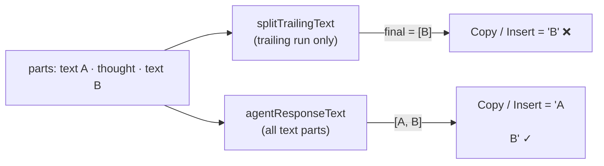
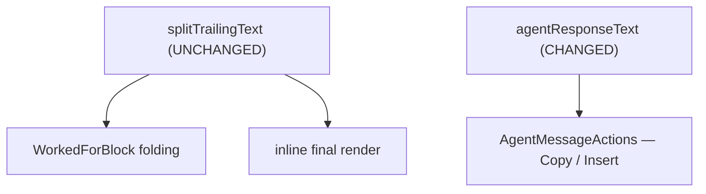

## Summary



Copy / Insert truncate agent responses because the helper reuses
`splitTrailingText`, which keeps only the **last contiguous run** of `text`
parts. Fix: collect **every** non-empty `text` part in stream order, and rename
`finalAnswerText` → `agentResponseText` (it no longer returns only the polished
final answer). `splitTrailingText` (and the "Worked for X" folding) is untouched.

## Contract

```ts
agentResponseText(parts: AgentMessagePart[]): string
```

- Collects **all** `kind: "text"` parts in stream order (was: trailing run only).
- Drops empty / whitespace-only text parts, then joins with `"\n\n"`.
- Result passed through `cleanMessageForCopy` (think-tags, tool markers, 3+
  newlines → 2, trim) — unchanged sanitization.
- `[text "A", thought, text "B"]` → `"A\n\nB"`; tool-only / `[]` → `""`.

## Decisions

- D1: `agentResponseText` gathers all `text` parts, not the trailing run [assumed] (issue spec)
- D2: Filter empty / whitespace-only text parts before joining ← q1
- D3: Leave `splitTrailingText` and "Worked for X" folding unchanged ← q2 / issue scope
- D4: Accept inline-vs-copy mismatch on collapsed turns (copy may include folded narration) ← q2
- D5: Keep the `"\n\n"` separator; `cleanMessageForCopy` collapses any 3+ newline pileup ← issue open-q [assumed]
- D6: Flip the existing "trailing run only" test to assert all-text behavior [assumed] (success criteria)
- D7: Rename `finalAnswerText` → `agentResponseText`; the name "final answer" no longer fits once all text is collected [assumed] (review t1)

| Pick | Approach                                         | Tradeoff                                                      |
| ---- | ------------------------------------------------ | ------------------------------------------------------------- |
| ✓    | Collect all `text` parts in `agentResponseText`  | completeness; copy may include mid-research narration         |
|      | Widen `splitTrailingText` to span dropped blocks | also changes "Worked for X" folding — explicitly out of scope |

## Impact



`agentResponseText` has a single consumer: `AgentTrailView.tsx:64` →
`AgentMessageActions` (Copy / Insert). `splitTrailingText` stays as-is, so both
its consumers — the "Worked for X" fold and the inline final render — are
unaffected. Blast radius is the clipboard / editor-insert text only.

## Phases

### Phase 1 — Collect all text parts in `agentResponseText`

Goal: `agentResponseText` returns every non-empty `text` part joined in stream
order, sanitized as today; `splitTrailingText` is not modified.

Files:

- `src/agentMode/ui/agentTrail.ts` — rename `finalAnswerText` →
  `agentResponseText` and rewrite it to filter `parts` to non-empty `text`
  parts, map to `.text`, `join("\n\n")`, then `cleanMessageForCopy`. Update the
  doc comment to drop the "trailing run" wording. `splitTrailingText` untouched.
- `src/agentMode/ui/AgentTrailView.tsx` — update the import and the single call
  site (`const answer = agentResponseText(parts)`, line 64).
- `src/agentMode/ui/agentTrail.test.ts` — update the import + `finalAnswerText`
  references to `agentResponseText`; flip the existing trailing-run test; add the
  interleaved-thought, interleaved-tool, whitespace, and tool-only cases.

Verification: `npm run test -- agentTrail` green; `npm run format && npm run lint` clean.

```gwt
Given parts [text "A", thought "Thought for < 1s", text "B"]
When agentResponseText runs
Then it returns "A\n\nB"

Given parts [text "A", tool_call, text "B"]
When agentResponseText runs
Then it returns "A\n\nB"

Given parts [text "A", text "   ", text "B"]
When agentResponseText runs
Then it returns "A\n\nB" with no stray blank line

Given a tool-only turn [thought, tool_call] (no prose)
When agentResponseText runs
Then it returns "" so Copy / Insert stay gated off

Given any parts
When splitTrailingText runs
Then its research/final split is byte-for-byte unchanged (existing tests pass)
```

## Risks

> [!risk]
> Copied / inserted output can now include mid-research narration the agent
> emitted between tool calls (e.g. "Let me check…"). Accepted per the issue —
> completeness over silent truncation.

> [!risk]
> `splitTrailingText` is shared with the "Worked for X" fold. Touching it would
> regress folding. Mitigation: change only `agentResponseText`; keep all existing
> `splitTrailingText` tests green.

## Open Questions

None — q1 (filter empties) and q2 (scope to `agentResponseText`, accept mismatch)
are resolved.

## Interview

### q1 — How should finalAnswerText handle empty / whitespace-only text parts when collecting all text parts and joining with "\n\n"?

- Options: Filter them out before joining (recommended) | Keep them; rely on cleanMessageForCopy to collapse | Keep them as-is
- Answer: Filter them out before joining

### q2 — In a collapsed 'Worked for X' turn, the inline view shows only the trailing prose, but after this fix Copy/Insert will grab ALL prose (including mid-research narration folded into 'Worked for X'). How do we handle that see-vs-copy mismatch?

- Options: Accept it — scope change to finalAnswerText only (per the issue) (recommended) | Also render all text parts inline in the collapse view
- Answer: Accept it — scope change to finalAnswerText only (per the issue)
